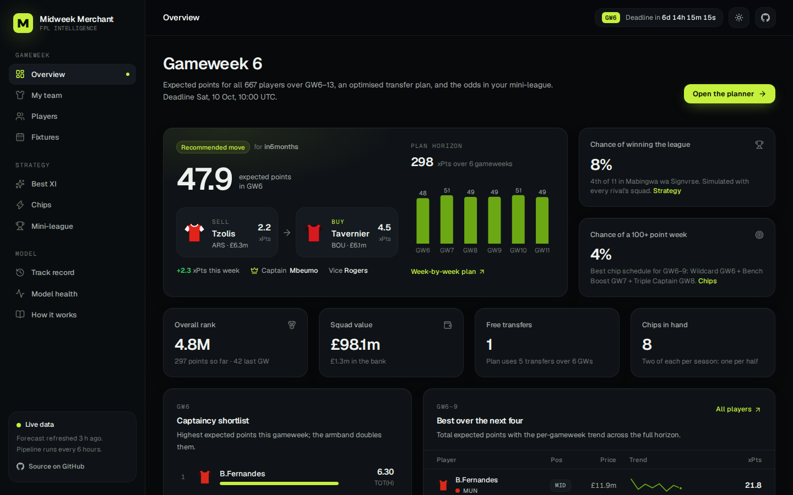
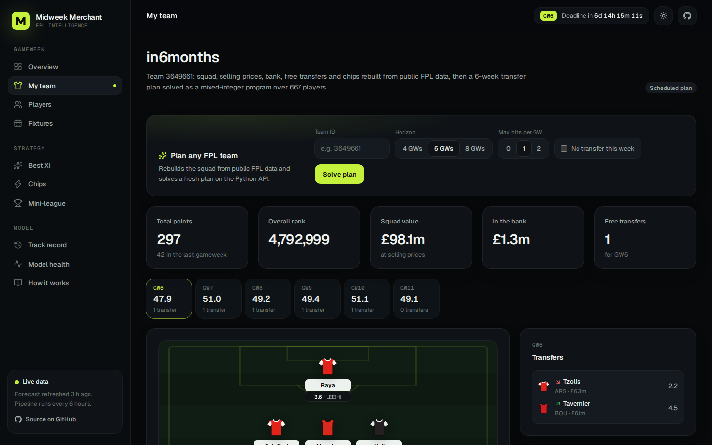
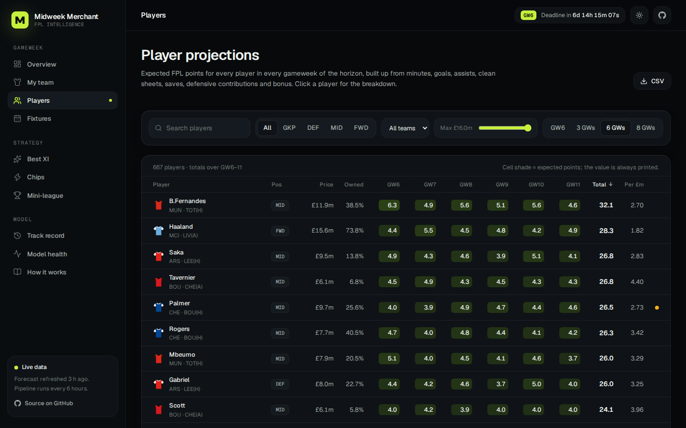
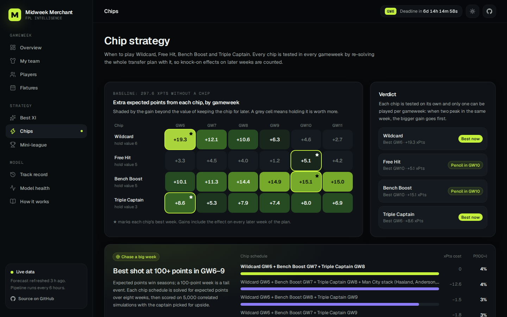
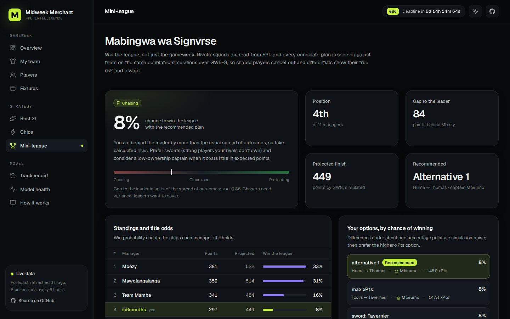
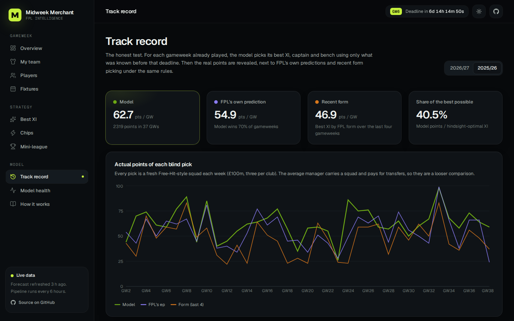
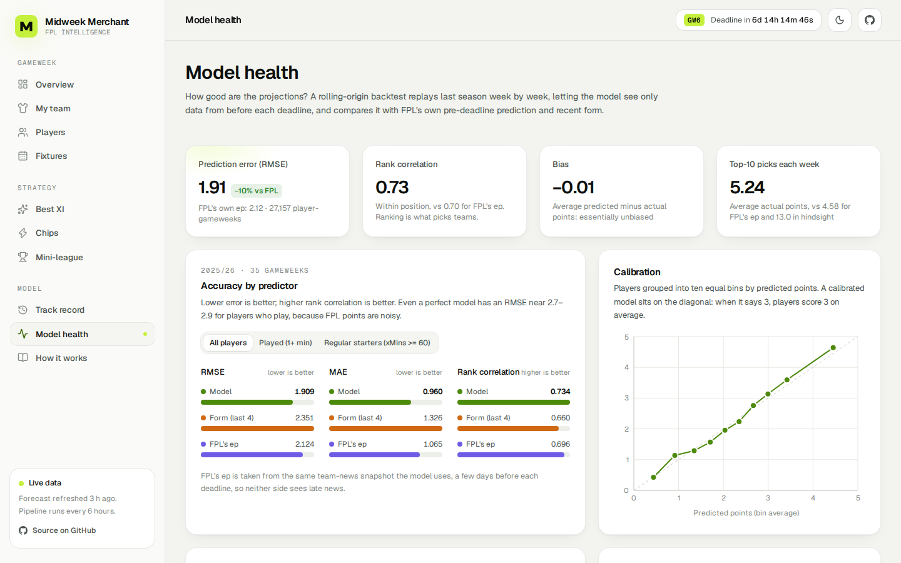

# Midweek Merchant

An expected-points forecaster, squad optimiser and mini-league strategist for **Fantasy Premier League
2026/27**, with a React dashboard on top.

**Live dashboard:** [midweek-merchant.onrender.com](https://midweek-merchant.onrender.com)



It ingests FPL, historical and betting-market data and projects every player's expected points (xPts) for
the next eight gameweeks. From those projections it builds the best squad for each gameweek. Given your
team ID, it rebuilds your squad, selling prices, bank, free transfers and remaining chips, then plans
transfers, captaincy and chip timing. Finally it ranks plans by your **chance of winning your mini-league**,
not just by points.

- **Validated blind:** across 37 gameweeks of 2025/26, the model's XI, picked before each deadline, averaged
  62.7 points against 54.9 for FPL's own prediction and outscored it in 70% of gameweeks.
- **Accurate per player:** RMSE 1.91 vs 2.12 for FPL's ep over 27,000 player-gameweeks, with calibration on the diagonal.
- **Automated:** a GitHub Actions pipeline refreshes data, forecasts, plans and hindcasts every six hours.

## Quick start

```bash
uv sync                                  # Python 3.11+, installs everything
uv run mm ingest                         # FPL API + vaastav history + football-data odds (~40 s)
uv run mm forecast                       # xPts for the next 8 GWs
uv run mm best-squad                     # best XI per GW + a wildcard draft
uv run mm plan --team-id 1234567         # your transfer/captain plan
uv run mm league --league-id 98765 --team-id 1234567
uv run mm ceiling --team-id 1234567      # plans ranked by the chance of a 100+ week in the next 4 GWs
uv run mm hindcast --team-id 1234567 --gw 5   # your own squad at a past deadline, picked blind
```

Your team ID is the number in your FPL points-page URL (`/entry/<ID>/event/...`). Your league ID is the
number in the league URL (`/leagues/<ID>/standings/c`). No FPL login is needed.

## Dashboard (React)

The dashboard in `web/` is a React 19 + TypeScript app (Vite, Tailwind CSS v4, Recharts, TanStack Query). Python
does all the data and modelling:

```
FPL API, match history, odds ──▶ Python pipeline (models, optimiser, simulations)
                                   │  every 6 h on GitHub Actions
                                   ▼
                        data branch: web/*.json  ──▶  React dashboard (GitHub Pages)
                                                            │ optional
                                                            ▼
                                        FastAPI live planner (src/midweek_merchant/api.py)
```

| Page | What it shows |
|---|---|
| **Overview** | This week's recommended move, plan horizon, title odds, chance of a 100+ week, captaincy shortlist, best players and fixture runs |
| **My team** | The squad on a pitch, the week-by-week transfer plan, chips held and the squad with selling prices. With the API configured, **plan any FPL team** live |
| **Players** | Sortable, filterable xPts for every player and gameweek, a drawer with each player's points breakdown, and the price-change watch |
| **Fixtures** | Fixture ticker coloured by expected goals or clean-sheet chance, and the team-strength map |
| **Best XI** | Best possible squad per gameweek (Free Hit view) against your plan, and the best wildcard draft |
| **Chips** | Gain from every chip in every gameweek, best-week verdicts, the **chase a big week** planner and the blank/double calendar |
| **Mini-league** | Race stance, standings with title odds, options ranked by chance of winning, effective ownership, captaincy, head to head and rivals' chips |
| **Track record** | Blind XIs scored on reality against FPL's prediction, form and the average manager, with any gameweek on the pitch |
| **Model health** | Backtest accuracy against baselines, calibration, tail calibration of the simulator and live tracking |
| **How it works** | Architecture and methodology |

Club kits are the official FPL images, loaded from the FPL site; they belong to the clubs and the Premier League.

|  |  |
|---|---|
|  |  |
|  |  |

**Run it locally**

```bash
cd web
npm ci
npm run data      # writes the JSON bundle from your local outputs (uv run mm export-web)
npm run dev       # http://localhost:5173
```

Without local outputs, run `uv run mm sync` first to download the published ones. To try the live planner, start the API with `uv run --extra api mm serve` and put
`VITE_API_URL=http://localhost:8000` in `web/.env.development.local`.

**Deploy (free)**

The live site runs on [Render](https://render.com)'s free tier as two services defined in `render.yaml`: the static
dashboard (`midweek-merchant`) and the live-planner API (`midweek-merchant-api`). The dashboard build downloads the
published data and bakes it in as a fallback; at runtime it reads the fresh bundle from the `data` branch. The API
sleeps after 15 minutes without traffic, so the first plan after a pause takes about a minute.

GitHub Pages works too: in **Settings → Pages**, set the source to **GitHub Actions**, and the `web` workflow deploys
on every push to `main` that touches `web/`. To enable the live planner there, add a repository variable `MM_API_URL`
with the API's URL and re-run the workflow.

## Automation (GitHub Actions)

`.github/workflows/refresh.yml` runs every 6 hours (and on demand). Each run:

1. Refreshes all data.
2. Forecasts expected points.
3. Optimises the best squads.
4. Plans your team and chips, and analyses your league, if configured.
5. Re-runs the backtest weekly.
6. Force-pushes a single-commit **`data` branch** with the results, including the dashboard's JSON bundle
   under `web/`. The repo does not grow, but the point-in-time archive of player news and prices accumulates
   inside it.

To configure it, go to **Settings → Secrets and variables → Actions**:

| Name | Kind | Purpose |
|---|---|---|
| `ODDS_API_KEY` | secret (optional) | [the-odds-api.com](https://the-odds-api.com) free key for fresh pre-deadline odds (about 2 credits per call, gated to 12-hourly and 3-hourly near deadlines) |
| `FPL_TEAM_ID` | variable (optional) | Precompute your plan and chip report |
| `FPL_LEAGUE_ID` | variable (optional) | Precompute your league analysis |
| `MM_API_URL` | variable (optional) | URL of the live-planner API, baked into the dashboard build |

`ci.yml` runs ruff and the Python tests, then formats, lints, type-checks and builds the dashboard. `web.yml`
deploys the dashboard.

## Analyst console (Streamlit)

`uv run streamlit run app/streamlit_app.py` opens the original Streamlit app. It runs the models in-process,
so it can add transfers you have already made this week, lock or ban players, override availability and
compare alternative plans. Like the React dashboard, it downloads the published bundle when there is no local
data. It can be hosted on [Streamlit Community Cloud](https://share.streamlit.io) (repository
`moses946/midweek-merchant`, main file `app/streamlit_app.py`); `requirements.txt` installs the package.

## How it works

### Expected points: a structural model

- **Team strength**
  - Fits a time-decayed, ridge-regularised Poisson model (Dixon–Coles family, with low-score correction ρ)
    to a blend of goals, xG and the goal expectancy implied by each past match's opening odds.
  - The market target matters most. Without it the ratings were far flatter than the bookmakers', which
    understated favourites, and with them good teams' attackers and clean sheets.
  - `uv run mm diagnose team-strength` tunes decay, ridge and the market weight point-in-time over 2024-25 and
    2025-26, scoring forecasts for the next six gameweeks against goals scored. Poisson deviance improved from
    1.082 to 1.062; the bookmakers' own opening odds score 1.061 on the same fixtures. That means the
    ratings now match the market even for fixtures with no odds yet.
  - Championship matches are included so promoted clubs get ratings.
  - Bookmaker odds (1X2 and over/under, with the margin removed) are converted to goal expectancies. For
    upcoming fixtures that have odds, they are added to the fit as pseudo-observations and blended into the
    nearest fixtures.
- **Minutes**
  - Uses recency-weighted rates of starting, lasting 60 minutes and coming off the bench.
  - Runs of three or more zero-minute games are treated as absences, not rotation.
  - FPL status, chance of playing, "Expected back <date>" news and loan restrictions set availability per
    fixture.
  - Raw start and 60-minute rates are mapped through monotone curves fitted on 2025-26 backtests
    (`uv run mm diagnose minutes`). The recency-weighted rates were too cautious for regular starters: a
    0.83 chance of 60+ minutes came true 90% of the time. Checked on 2026-27, the Brier score for 60+
    minutes fell from 0.1062 to 0.1052.
  - Each week further ahead, availability falls 1.5% for injuries, bans and drops not yet known. Without
    this, forecasts 2–6 weeks out over-predicted total points by 4–10%.
  - You can override availability manually in the UI.
- **Player rates**
  - Each player's share of team xG and xA is estimated with empirical-Bayes shrinkage towards price/position
    priors.
  - Defensive contributions (DefCon) use a negative-binomial count model: CBIT ≥ 10 for defenders,
    CBIRT ≥ 12 for midfielders and forwards.
  - Also modelled: goalkeeper saves per unit of xG faced, card rates, and a bonus model fitted on 2026/27 data
    (the bonus points system changed this season).
- **Points**: the 2026/27 scoring rules give analytic xPts per fixture, summed across double gameweeks. The rules
  engine reproduces every line of FPL's official points breakdown in the test data.
- **Simulation**: a correlated Monte Carlo draws scorelines and allocates goals and assists to the players on the
  pitch, so teammates and opponents are properly correlated. The mini-league layer uses it.

### Optimiser (MILP, HiGHS)

- **Decisions**: squad, lineup, captain, bench, transfers (using selling prices) and free-transfer banking from
  1 to 5.
- **Penalties**: hits are capped and penalised.
- **Chips**: all four, under the 2026/27 rules:
  - two sets, split at GW19/20;
  - one chip per gameweek;
  - no consecutive Free Hits.
- **Objective**: expected points with weekly decay, plus bench weights, a terminal value for banked free
  transfers, and an option value for unused chips.
- **Extras**: alternative plans (via no-good cuts) and noisy re-solves for sensitivity.

### Mini-league strategy

- **Why ownership matters**: the expected change in your gap to any rival depends only on your own xPts, so
  ownership matters through *variance*.
- **What it does**: each candidate plan (max-xPts, alternatives, "shield" and "sword" variants) is scored on the
  same simulations as your rivals' predicted lineups. It then reports P(1st after the horizon) and P(win league),
  extending past the horizon using the simulated spread of score *differences*.
- **Advice**: a stance is given based on your gap measured in units of that spread:
  - behind: chase with swords;
  - ahead: cover shields;
  - close: maximise xPts.

### Hindcast: blind XI picks scored on reality

`uv run mm hindcast --gw 5` (or `--season 2025-26 --gws 2-38`; results on the **Track record** page) takes a gameweek that
has already been played and has the model pick its best XI, captain and bench. It uses only what was known before
that deadline:

- earlier results and xG;
- the market's opening odds;
- injury news, chance of playing and prices from the FPL snapshot taken after the previous gameweek
  ([FPL-Elo-Insights](https://github.com/olbauday/FPL-Elo-Insights)).

The real points are then revealed. FPL's own pre-deadline expected points and recent form pick under the same rules
(£100m, max 3 per club, Free-Hit style), and every pick is scored with FPL auto-subs and the vice-captain rule.

| Blind pick | 2025-26 (GW2–38): avg points/GW | Total | 2026-27 (GW2–5): avg points/GW |
|---|---|---|---|
| **This model** | **62.7** | **2319** | **65.8** |
| FPL's own ep | 54.9 | 2030 | 57.2 |
| Recent form | 46.9 | 1736 | 50.5 |
| Best XI possible in hindsight | 155.1 | 5738 | 159.5 |
| Average manager | — | — | 62.2 |

- The model's XI outscored FPL's own pick in 70% of 2025-26 gameweeks.
- `tests/test_hindcast.py` proves there is no leakage. It deletes every statistic from the target gameweek onwards
  and asserts the predictions and the picked XI are unchanged. It also checks that the test fails if a leak is
  introduced.

With `--team-id`, the hindcast starts from **your** squad, bank and free transfers as they were at that deadline. It
shows a ladder of options, each picked blind and scored on the real points:

- what you fielded (re-scored, so it must match FPL's total);
- the model's XI from the same 15;
- the model's best use of your free transfer, with and without hits;
- a Free Hit with your budget;
- hindsight references.

### Chasing a 100+ gameweek

`uv run mm ceiling --target 100 --weeks 4` (or **Chips → Chase a big week**) answers a different question from the
planner. Instead of "most expected points", it asks "best chance of at least one gameweek ≥ target in the next N".

- **Candidate plans.** Every chip schedule the rules allow over those weeks: no chip, Wildcard, Bench Boost, Triple
  Captain, Wildcard followed by Bench Boost and/or Triple Captain, and Free Hit. Each is solved for expected points over
  8 gameweeks, so later weeks are not sacrificed for nothing. The best two chip plans are re-solved with a **stack** of
  the top three attackers from the team expected to score most in the chip week; same-team attackers boom together.
- **Scoring on tails.** Every plan is scored on 5,000 correlated simulations. In each week the captain (or Triple
  Captain) is re-chosen to maximise P(week ≥ target), not the mean.
- **Output.** P(any week ≥ target), P per week, the expected best week, a 1-in-100 week, and expected points given up
  over 8 gameweeks versus the max-expected-points plan (counting the value of chips kept).
- **Tail calibration** (`uv run mm diagnose tails`). The simulator is checked on blind hindcast XIs over 41
  gameweeks of 2025-26 and 2026-27:
  - the simulated mean was 62.9 against 63.0 actual;
  - the raw spread was slightly too wide, so one spread factor (k = 0.85) is fitted by CRPS and applied to tail
    probabilities;
  - with it, those weeks expected 5.9 scores of 80+ (6 happened) and 1.2 of 100+ (0 happened).

### Backtest: per-player accuracy (2025-26, 35 gameweeks)

The test is rolling-origin with the same point-in-time inputs.

| Predictor | RMSE (all) | RMSE (played) | Rank corr. (all) | Avg points of weekly top-10 |
|---|---|---|---|---|
| **This model** | **1.91** | **2.93** | **0.73** | **5.2** |
| FPL ep (pre-deadline) | 2.12 | 3.29 | 0.70 | 4.6 |
| Recent form (last 4) | 2.35 | 3.21 | 0.66 | 3.2 |

Calibration is close to the diagonal across deciles. The scheduled job refreshes the backtest and hindcasts weekly
(this season's hindcast on every run). The dashboard's Track record and Model health pages show them.

### Without odds, weeks ahead (how the live planner runs)

The table above gives the model each gameweek's opening odds. Live, odds usually exist only for the next round,
or none at all, while the planner looks six weeks ahead. So the backtest also forecasts from 15 origin gameweeks
of 2025-26 up to five weeks ahead, with no odds:

| Weeks ahead | RMSE | Bias (pts/player) | Rank corr. within position | Top-120: predicted | Top-120: actual |
|---|---|---|---|---|---|
| 0 | 1.90 | −0.00 | 0.74 | 3.60 | 3.84 |
| 1 | 2.01 | +0.04 | 0.69 | 3.47 | 3.43 |
| 2 | 2.02 | +0.04 | 0.67 | 3.48 | 3.39 |
| 3 | 2.07 | +0.05 | 0.65 | 3.43 | 3.35 |
| 4 | 2.07 | +0.04 | 0.64 | 3.42 | 3.25 |
| 5 | 2.07 | +0.05 | 0.62 | 3.31 | 3.13 |

- The next gameweek is as accurate without odds as with them, now that the team ratings track the market.
- The best players are under-predicted for the next week, by about 6% for the top 120.
- Further out, projections run a few percent high, even after the 1.5%-a-week absence allowance.
- Read a projected total for weeks 3–6 as a slightly optimistic mean, not as a floor.

### Verified rule details

- Rules are read live from FPL's `game_config`. Key values: goalkeeper goal 10, DefCon +2, `max_extra_free_transfers` 4, sell-on fee 50%.
- **Free transfers freeze through Wildcard/Free Hit weeks**: they don't accrue. This was checked against
  250 top managers' hit charges (0 mismatches vs 5 for the accrue rule). Re-check it with
  `uv run mm diagnose ft-rule`.

## Configuration

`config.yaml` holds the season, horizon, decay, bench weights, free-transfer values, chip option values and model
settings. Environment variables `FPL_TEAM_ID`, `FPL_LEAGUE_ID`, `ODDS_API_KEY` and `MM_DATA_DIR` override it.

The optional `override.yaml` (git-ignored) holds manual corrections:

```yaml
team:
  pending: [{out: 123, in: 456}]   # transfers already made this week
  free_transfers: 2
  bank: 5                          # tenths of £m
minutes:
  321: {p_start: 0.0}              # e.g. injury news the model has not seen
```

## Data sources

| Source | Use |
|---|---|
| FPL API (`fantasy.premierleague.com/api/`) | Players, fixtures, per-match stats, live points breakdown, entries, picks, transfers, leagues |
| [vaastav/Fantasy-Premier-League](https://github.com/vaastav/Fantasy-Premier-League) | Per-match history for 2023-24 to 2025-26 (training, priors, backtest) |
| [football-data.co.uk](https://www.football-data.co.uk) | Results, xG, opening/closing 1X2 and over/under odds (E0 + Championship) |
| [the-odds-api](https://the-odds-api.com) (optional) | Fresh odds for upcoming fixtures |
| [FPL-Elo-Insights](https://github.com/olbauday/FPL-Elo-Insights) | Per-gameweek FPL snapshots (news, prices, FPL ep) for leak-free hindcasts and backtests |

Requests are throttled and cached. Please keep them that way.

## Limitations and roadmap

- **Team news in backtests and hindcasts is a few days old.** It comes from the snapshot after the previous
  gameweek, so news that broke just before a deadline is missed. Our own snapshot archive (`data/raw/snapshots`)
  captures the state right up to each deadline from now on, and will later train a LightGBM minutes model.
- **Projections cover 8 gameweeks.** Chip planning for distant blank/double gameweeks relies on the calendar view
  until those weeks enter the horizon.
- **Rival transfers are not modelled.** Rivals are assumed to keep their squads and play their best XI by our
  projections.
- **Penalty-taker changes** are only captured through each player's historical xG share.

## Development

```bash
uv run pytest          # rules, optimiser property tests, simulation/league tests
uv run ruff check src tests app && uv run ruff format src tests app
uv run mm backtest     # rolling backtest on 2025-26 (with odds, and without odds 0-5 weeks ahead)
uv run mm diagnose team-strength   # tune team ratings against goals; compare with the market
uv run mm diagnose minutes         # fit the minutes calibration curves on 2025-26, check on 2026-27
cd web && npm run format && npm run lint && npm run build   # dashboard
```
